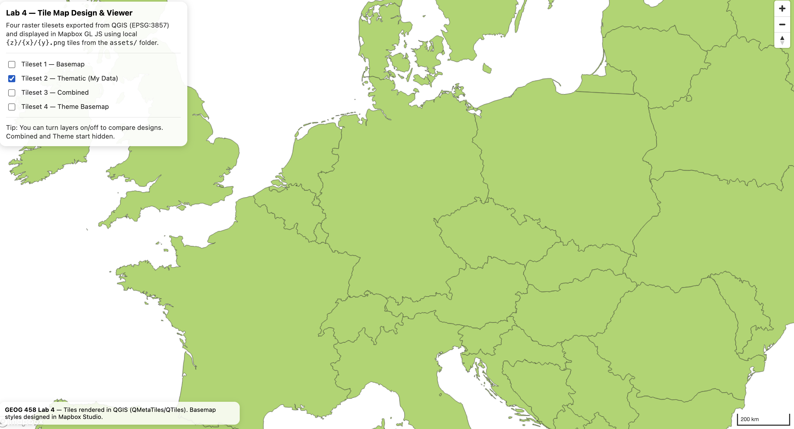

# GEOG 458 — Lab 4: Map Design and Tile Generation

## Web Map URL
https://bayn3t.github.io/lab4reedbayless458/

---

## Study Area
This project focuses on a continental-scale study area covering much of **Europe**.  
The extent was intentionally limited to avoid excessive tile generation while still supporting regional comparison and cartographic context.

All tiles were generated in **Web Mercator (EPSG:3857)** and displayed using Mapbox GL JS.

---

## Zoom Levels by Tileset
- **Tileset 1 (Basemap):** Zoom levels 4–7  
- **Tileset 2 (Thematic):** Zoom levels 4–7  
- **Tileset 3 (Combined):** Zoom levels 4–7  
- **Tileset 4 (Theme Basemap):** Zoom levels 4–7  

Zoom ranges were selected to balance geographic coverage, visual clarity, and GitHub Pages file-size constraints.

---

## Tileset Descriptions

### Tileset 1 — Basemap (Mapbox Studio)
This tileset is a customized **Classic Mapbox basemap** designed to provide neutral geographic context.  
Colors, fonts, and visual hierarchy were adjusted in Mapbox Studio to reduce clutter while maintaining legibility across continental scales.

This basemap primarily functions as contextual reference for thematic layers.

---

### Tileset 2 — Thematic: European Political Boundaries
This tileset visualizes **sovereign-level political boundaries** across Europe using a geospatial dataset loaded into QGIS (e.g., Natural Earth Admin 0 Countries).

**Relevance of sovereignty:**  
Sovereign boundaries define nation-states and political jurisdictions, which are fundamental to understanding European geography, governance, and regional organization. At a continental scale, sovereignty provides a clear and interpretable thematic variable that allows for comparison across countries without unnecessary local detail.

The dataset was styled as a standalone thematic layer and exported independently from any basemap.

---

### Tileset 3 — Combined Basemap + Thematic
This tileset combines **Tileset 1 (Basemap)** and **Tileset 2 (Political Boundaries)** into a single raster tileset.

The combined export demonstrates how multiple layers can be composited into one tileset for improved performance and consistent cartographic presentation when interactive layering is not required.

---

### Tileset 4 — Theme Basemap: Political Europe
This tileset is a **Mapbox Studio–designed thematic basemap** emphasizing political structure across Europe.

The style was derived from a Classic Mapbox basemap and customized to:
- Increase the visual prominence of national boundaries
- Reduce visual noise from minor roads and points of interest
- Use a restrained color palette appropriate for political reference mapping

Unlike Tileset 2, this tileset functions as a **basemap**, communicating political structure through cartographic design rather than explicit data overlays.

---

## Screenshots

Screenshots were captured from the live web map with only one tileset visible at a time.

### Tileset 1 — Basemap

### Tileset 2 — Thematic (Political Boundaries)

### Tileset 3 — Combined

### Tileset 4 — Theme Basemap

